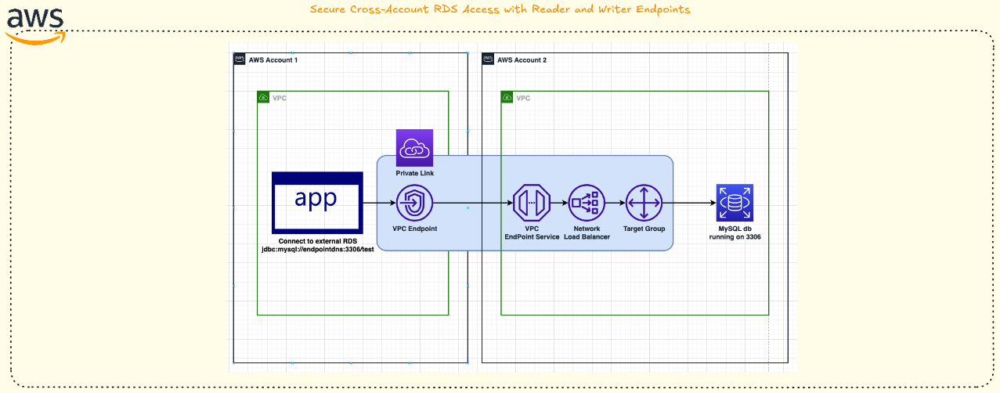

<div align="center">
  


# Acesso Seguro Cross-Account ao RDS com Endpoints Reader e Writer

**Atualizado: 14 de Janeiro de 2026**

[](https://github.com/nicoleepaixao)
[](https://github.com/nicoleepaixao/aws-rds-privatelink-nlb)
[](https://nicoleepaixao.medium.com/)

<p align="center">
  <a href="README-PT.md">🇧🇷</a>
  <a href="README.md">🇺🇸</a>
</p>

</div>

---

<p align="center">
  
</p>

## **Visão Geral**

Este repositório documenta um padrão end-to-end para expor **endpoints writer e reader do RDS Aurora/MySQL** de uma conta AWS (provedor) para outra conta AWS (consumidor) usando Internal Network Load Balancer (NLB), Target Groups baseados em IP, portas de listener separadas e AWS PrivateLink. Todo o tráfego permanece **dentro da rede privada da AWS** sem exposição à internet, VPC peering ou complexidade de VPN.

---

## **Informações Importantes**

### **O Que Esta Solução Faz**

| **Aspecto** | **Detalhes** |
|------------|-------------|
| **Arquitetura** | Acesso RDS cross-account via PrivateLink |
| **Fluxo de Tráfego** | NLB Provedor → Endpoints RDS → VPC endpoint Consumidor |
| **Separação de Portas** | Reader (3306) e Writer (3307) em portas diferentes |
| **Segurança** | Sem exposição à internet, apenas IPs privados |
| **Sem Complexidade** | Sem VPC peering, VPN ou tabelas de roteamento |
| **Serviço Gerenciado** | AWS PrivateLink gerencia conectividade |

### **Por Que Isso Importa**

Acesso tradicional a banco de dados cross-account requer:

- **VPC Peering**: Roteamento complexo e conflitos CIDR
- **Conexões VPN**: Custo adicional e manutenção
- **Endpoints Públicos**: Risco de segurança e preocupações de compliance
- **Transit Gateway**: Caro para casos de uso simples
- **Gerenciamento Manual de DNS**: Propenso a erros e frágil

### **Benefícios da Solução**

✅ **Zero Exposição à Internet**: Todo tráfego permanece no backbone AWS  
✅ **Sem VPC Peering**: Arquitetura de rede simplificada  
✅ **Separação Clara**: Provedor controla acesso, consumidor controla uso  
✅ **Roteamento Baseado em Porta**: Reader e writer em portas diferentes  
✅ **Gerenciado pela AWS**: PrivateLink gerencia conectividade automaticamente  
✅ **Escalável**: Adicionar mais consumidores sem mudanças no lado do provedor

### **Princípios Chave de Design**

- **Consumidor vê apenas DNS NLB/PrivateLink**: Endpoints RDS permanecem privados
- **Porta 3306 no NLB**: Mapeia para endpoint reader
- **Porta 3307 no NLB**: Mapeia para endpoint writer
- **Target groups baseados em IP**: Registro direto de IP para endpoints RDS
- **Security Groups**: Controle de acesso granular em cada camada

---

## **Casos de Uso**

| **Caso de Uso** | **Aplicação** |
|--------------|-----------------|
| **AWS Glue Jobs** | Ler de RDS hospedado em outra conta |
| **Analytics Cross-Account** | Ferramentas BI acessando bancos centralizados |
| **Arquitetura Multi-Conta** | Isolamento estrito de rede com acesso controlado |
| **Compartilhamento de Dados Parceiro** | Compartilhar bancos sem exposição pública |
| **Plataforma de Dados** | Data lake centralizado acessando bancos fonte |
| **Disaster Recovery** | Replicação de banco cross-account |

---

## **Pré-requisitos**

### **Conta Provedor**

| **Requisito** | **Propósito** |
|-----------------|-------------|
| RDS Aurora/MySQL Cluster | Banco de dados a ser compartilhado |
| VPC com subnets privadas | Deployment do NLB |
| Security Groups | Controlar acesso ao RDS e NLB |
| Permissões IAM | Criar NLB, Target Groups, PrivateLink |

### **Conta Consumidor**

| **Requisito** | **Propósito** |
|-----------------|-------------|
| VPC com subnets privadas | Deployment VPC Endpoint |
| Security Groups | Controlar acesso de aplicações |
| Permissões IAM | Criar VPC Endpoints |

---

## **Guia de Implementação**

## **Passo 1: Descobrir Endpoints RDS**

### **Listar Todos os DB Clusters**

```bash
aws rds describe-db-clusters \
  --query "DBClusters[].{Cluster:DBClusterIdentifier,Writer:Endpoint,Reader:ReaderEndpoint}" \
  --output table
```

### **Definir ID do Cluster**

```bash
CLUSTER_ID=<your-db-cluster-id>
```

### **Obter Endpoint Writer**

```bash
WRITER=$(aws rds describe-db-clusters \
  --db-cluster-identifier "$CLUSTER_ID" \
  --query "DBClusters[0].Endpoint" \
  --output text)

echo "Endpoint Writer: $WRITER"
```

### **Obter Endpoint Reader**

```bash
READER=$(aws rds describe-db-clusters \
  --db-cluster-identifier "$CLUSTER_ID" \
  --query "DBClusters[0].ReaderEndpoint" \
  --output text)

echo "Endpoint Reader: $READER"
```

---

## **Passo 2: Resolver Endpoints para IPs Privados**

Target groups com `target-type=ip` requerem endereços IP. Execute de um ambiente que possa resolver DNS RDS (EC2 na mesma VPC, ou via VPN/DirectConnect).

### **Resolver IP Writer**

```bash
WRITER_IP=$(dig +short "$WRITER")
echo "IP Writer: $WRITER_IP"
```

### **Resolver IP Reader**

```bash
READER_IP=$(dig +short "$READER")
echo "IP Reader: $READER_IP"
```

**Alternativa (Linux):**

```bash
getent hosts "$WRITER"
getent hosts "$READER"
```

**Nota:** Você deve ver IPs privados dentro da faixa CIDR da VPC do provedor.

---

## **Passo 3: Configurar Security Groups**

### **Security Group RDS** (`sg-rds-privatelink`)

| **Direção** | **Tipo** | **Protocolo** | **Porta** | **Origem/Destino** |
|---------------|----------|--------------|----------|------------------------|
| Inbound | MySQL/Aurora | TCP | 3306 | sg-nlb-rds-privatelink |
| Outbound | Todo tráfego | All | All | 0.0.0.0/0 |

### **Security Group NLB** (`sg-nlb-rds-privatelink`)

| **Direção** | **Tipo** | **Protocolo** | **Porta** | **Origem/Destino** |
|---------------|----------|--------------|----------|------------------------|
| Inbound | MySQL/Aurora | TCP | 3306-3307 | CIDR VPC Provedor |
| Outbound | MySQL/Aurora | TCP | 3306 | sg-rds-privatelink |

### **Security Group Endpoint Consumidor** (`sg-consumer-privatelink`)

| **Direção** | **Tipo** | **Protocolo** | **Porta** | **Origem/Destino** |
|---------------|----------|--------------|----------|------------------------|
| Outbound | MySQL/Aurora | TCP | 3306-3307 | 0.0.0.0/0 |

---

## **Passo 4: Criar Target Groups**

### **Target Group Reader (Porta 3306)**

```bash
TG_READER_ARN=$(aws elbv2 create-target-group \
  --name tg-rds-reader-privatelink \
  --protocol TCP \
  --port 3306 \
  --target-type ip \
  --vpc-id <PROVIDER_VPC_ID> \
  --health-check-protocol TCP \
  --health-check-port traffic-port \
  --query "TargetGroups[0].TargetGroupArn" \
  --output text)

echo "ARN TG Reader: $TG_READER_ARN"
```

**Registrar IP Reader:**

```bash
aws elbv2 register-targets \
  --target-group-arn "$TG_READER_ARN" \
  --targets Id="$READER_IP",Port=3306
```

### **Target Group Writer (Porta 3307)**

```bash
TG_WRITER_ARN=$(aws elbv2 create-target-group \
  --name tg-rds-writer-privatelink \
  --protocol TCP \
  --port 3307 \
  --target-type ip \
  --vpc-id <PROVIDER_VPC_ID> \
  --health-check-protocol TCP \
  --health-check-port traffic-port \
  --query "TargetGroups[0].TargetGroupArn" \
  --output text)

echo "ARN TG Writer: $TG_WRITER_ARN"
```

**Registrar IP Writer:**

```bash
aws elbv2 register-targets \
  --target-group-arn "$TG_WRITER_ARN" \
  --targets Id="$WRITER_IP",Port=3307
```

---

## **Passo 5: Criar Internal Network Load Balancer**

```bash
NLB_ARN=$(aws elbv2 create-load-balancer \
  --name nlb-rds-privatelink \
  --type network \
  --scheme internal \
  --subnets <SUBNET_ID_1> <SUBNET_ID_2> <SUBNET_ID_3> \
  --security-groups <SG_NLB_ID> \
  --query "LoadBalancers[0].LoadBalancerArn" \
  --output text)

echo "ARN NLB: $NLB_ARN"
```

**Obter DNS do NLB:**

```bash
aws elbv2 describe-load-balancers \
  --load-balancer-arns "$NLB_ARN" \
  --query "LoadBalancers[0].DNSName" \
  --output text
```

---

## **Passo 6: Criar Listeners**

### **Listener Reader (TCP 3306)**

```bash
aws elbv2 create-listener \
  --load-balancer-arn "$NLB_ARN" \
  --protocol TCP \
  --port 3306 \
  --default-actions Type=forward,TargetGroupArn="$TG_READER_ARN"
```

### **Listener Writer (TCP 3307)**

```bash
aws elbv2 create-listener \
  --load-balancer-arn "$NLB_ARN" \
  --protocol TCP \
  --port 3307 \
  --default-actions Type=forward,TargetGroupArn="$TG_WRITER_ARN"
```

**Validação:**
- `<NLB_DNS>:3306` → encaminha para endpoint reader
- `<NLB_DNS>:3307` → encaminha para endpoint writer

---

## **Passo 7: Criar VPC Endpoint Service (Provedor)**

### **Criar Endpoint Service**

```bash
aws ec2 create-vpc-endpoint-service-configuration \
  --network-load-balancer-arns "$NLB_ARN" \
  --acceptance-required
```

**Com DNS privado customizado (opcional):**

```bash
aws ec2 create-vpc-endpoint-service-configuration \
  --network-load-balancer-arns "$NLB_ARN" \
  --acceptance-required \
  --private-dns-name rds-privatelink.example.com
```

### **Obter Informações do Serviço**

```bash
SERVICE_ID=$(aws ec2 describe-vpc-endpoint-service-configurations \
  --query "ServiceConfigurations[0].ServiceId" \
  --output text)

SERVICE_NAME=$(aws ec2 describe-vpc-endpoint-service-configurations \
  --query "ServiceConfigurations[0].ServiceName" \
  --output text)

echo "Service ID:   $SERVICE_ID"
echo "Service Name: $SERVICE_NAME"
```

**Nota:** Compartilhe o `SERVICE_NAME` com a conta consumidor.

---

## **Passo 8: Restringir Acesso (Allow Principals)**

Restrinja acesso para que apenas a conta consumidor possa criar endpoints:

```bash
aws ec2 modify-vpc-endpoint-service-permissions \
  --service-id "$SERVICE_ID" \
  --add-allowed-principals arn:aws:iam::<CONSUMER_ACCOUNT_ID>:root
```

---

## **Passo 9: Criar Interface VPC Endpoint (Consumidor)**

**Execute na conta consumidor:**

```bash
aws ec2 create-vpc-endpoint \
  --vpc-endpoint-type Interface \
  --vpc-id <CONSUMER_VPC_ID> \
  --service-name "$SERVICE_NAME" \
  --subnet-ids <CONSUMER_SUBNET_1> <CONSUMER_SUBNET_2> \
  --security-group-ids <SG_CONSUMER_ENDPOINT_ID>
```

Isso retorna um `VpcEndpointId` (ex.: `vpce-0abcd1234...`).

---

## **Passo 10: Aprovar Conexão (Provedor)**

**De volta na conta provedor:**

### **Listar Conexões Pendentes**

```bash
aws ec2 describe-vpc-endpoint-connections \
  --service-id "$SERVICE_ID" \
  --query "VpcEndpointConnections[].VpcEndpointId" \
  --output text
```

### **Aprovar Conexão**

```bash
aws ec2 accept-vpc-endpoint-connections \
  --service-id "$SERVICE_ID" \
  --vpc-endpoint-ids <VPCE_ID_FROM_ABOVE>
```

Após aprovação, o endpoint se torna **Available** e o tráfego flui.

---

## **Testando Conectividade**

### **Da VPC Consumidor (EC2 ou Glue)**

**Testar Conexão Reader:**

```bash
nc -vz <PRIVATELINK_DNS> 3306
```

**Testar Conexão Writer:**

```bash
nc -vz <PRIVATELINK_DNS> 3307
```

### **Conectividade com Banco de Dados**

**Reader:**

```bash
mysql -h <PRIVATELINK_DNS> -P 3306 -u <user> -p
```

**Writer:**

```bash
mysql -h <PRIVATELINK_DNS> -P 3307 -u <user> -p
```

### **URL JDBC AWS Glue**

```text
jdbc:mysql://<PRIVATELINK_DNS>:3306/<database>  # Reader
jdbc:mysql://<PRIVATELINK_DNS>:3307/<database>  # Writer
```

---

## **Melhores Práticas de Segurança**

| **Prática** | **Implementação** |
|--------------|-------------------|
| **Privilégio Mínimo** | Usar security groups dedicados para cada componente |
| **Isolamento de Rede** | Manter RDS apenas em subnets privadas |
| **Criptografia em Trânsito** | Habilitar SSL/TLS para conexões de banco |
| **Log de Auditoria** | Habilitar VPC Flow Logs e CloudTrail |
| **IP Whitelisting** | Restringir SG endpoint consumidor a CIDRs conhecidos |
| **Revisão Regular** | Auditar conexões VPC endpoint mensalmente |

---

## **Funcionalidades**

| **Funcionalidade** | **Descrição** |
|-------------|-----------------|
| **Acesso Cross-Account** | Compartilhamento seguro RDS sem VPC peering |
| **Separação de Portas** | Isolamento Reader (3306) e Writer (3307) |
| **Conectividade Privada** | Sem necessidade de exposição à internet |
| **Serviço Gerenciado** | AWS PrivateLink gerencia roteamento |
| **Escalável** | Adicionar múltiplas contas consumidor facilmente |
| **Flexível** | Funciona com Aurora, MySQL, PostgreSQL |
| **Seguro** | Security groups em cada camada |

---

## **Resumo de Casos de Uso**

- ✅ AWS Glue jobs lendo de RDS cross-account
- ✅ Analytics cross-account e ferramentas BI
- ✅ Arquiteturas multi-conta com isolamento estrito
- ✅ Compartilhamento de bancos com contas AWS parceiras
- ✅ Plataformas de dados centralizadas acessando bancos fonte
- ✅ Replicação cross-account para disaster recovery

---

## **Tecnologias Utilizadas**

| **Tecnologia** | **Propósito** |
|----------------|-------------|
| AWS RDS Aurora/MySQL | Banco de dados fonte |
| Network Load Balancer | Roteamento de tráfego e balanceamento |
| AWS PrivateLink | Conectividade segura cross-account |
| VPC Endpoint Service | Configuração de serviço lado provedor |
| Interface VPC Endpoint | Conexão lado consumidor |
| Security Groups | Controle de acesso de rede |
| Target Groups | Roteamento baseado em IP para endpoints RDS |

---

## **Estrutura do Projeto**

```text
aws-rds-privatelink-nlb/
│
├── README.md                      # Guia completo de implementação
│
├── scripts/
│   ├── setup-provider.sh          # Automação setup conta provedor
│   ├── setup-consumer.sh          # Automação setup conta consumidor
│   └── monitor-failover.py        # Script automação atualização IP
│
└── docs/
    ├── troubleshooting.md         # Problemas comuns e soluções
    └── architecture-diagram.png   # Referência visual arquitetura
```

---

## **Informações Adicionais**

Para mais detalhes sobre AWS PrivateLink, NLB e melhores práticas RDS, consulte:

- [AWS PrivateLink Documentation](https://docs.aws.amazon.com/vpc/latest/privatelink/) - Guia oficial
- [Network Load Balancer Guide](https://docs.aws.amazon.com/elasticloadbalancing/latest/network/) - Configuração NLB
- [RDS Aurora Best Practices](https://docs.aws.amazon.com/AmazonRDS/latest/AuroraUserGuide/Aurora.BestPractices.html) - Otimização de banco
- [VPC Endpoint Services](https://docs.aws.amazon.com/vpc/latest/privatelink/create-endpoint-service.html) - Setup PrivateLink

---

## **Conecte-se & Siga**

Mantenha-se atualizado com networking AWS e melhores práticas PrivateLink:

<div align="center">

[](https://github.com/nicoleepaixao)
[](https://www.linkedin.com/in/nicolepaixao/)
[](https://medium.com/@nicoleepaixao)

</div>

---

## **Aviso Legal**

Este guia de implementação fornece um padrão pronto para produção para acesso RDS cross-account via PrivateLink. Configurações de serviços AWS, preços e recursos podem variar. Sempre teste em ambientes de não-produção antes de implantar em produção. Implemente monitoramento adequado para cenários de failover RDS para garantir que target groups de IP permaneçam sincronizados. Consulte documentação oficial da AWS para informações mais atuais.

---

<div align="center">

**Construa arquiteturas AWS seguras com confiança!**

*Documento Criado: 2 de Janeiro de 2026*

Made with ❤️ by [Nicole Paixão](https://github.com/nicoleepaixao)

</div>
